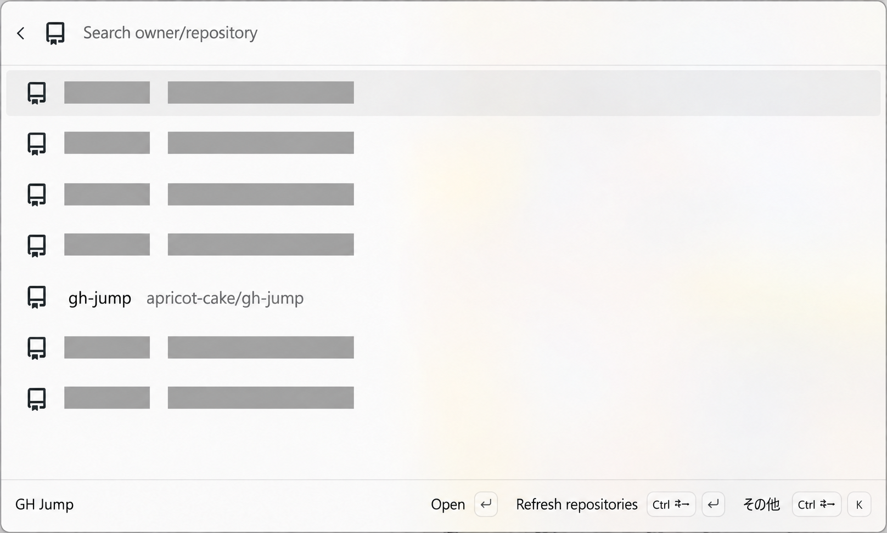
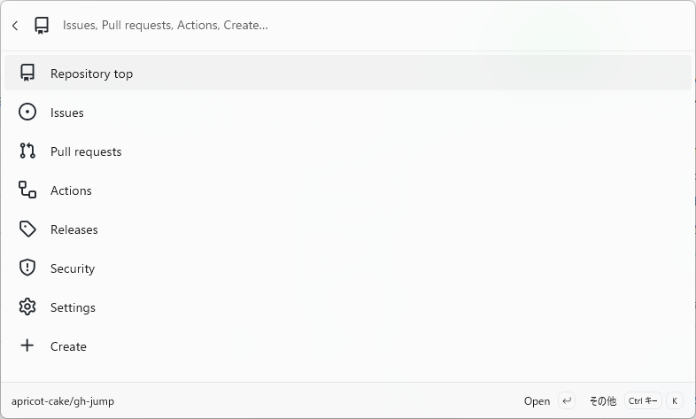
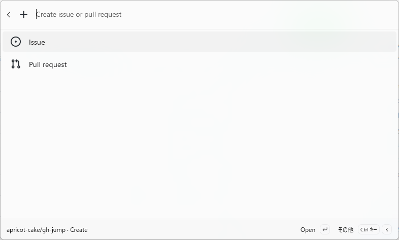

# GH Jump

GitHubのリポジトリを選び、トップページ、Issues、Pull requests、Actionsなどへ移動するPowerToys Command Palette拡張です。GitHub CLIでログイン済みの開発者を対象にしています。

## インストール

Windows 11、PowerToysのCommand Palette、GitHub CLIが必要です。

Microsoft Storeへ初回申請を提出し、現在は審査中です。公開後は[Microsoft Store](https://apps.microsoft.com/detail/9NN7GSPR8W9R)からインストールできます。WinGet、Extension Galleryには未公開です。

審査中は、ソースからビルドし、[開発用に登録](docs/CONTRIBUTING.md#開発用に登録する)して使用します。

## 使い方

Command PaletteでGH Jumpを開き、リポジトリを検索してEnterで選びます。続けてEnterを押すとリポジトリトップ、`a` → EnterでActionsを開きます。呼び出し用の `gh` はCommand Paletteの標準エイリアス設定で登録します。

認証、操作例、アクション一覧、制限事項は[使い方](docs/使い方.md)を参照してください。

リポジトリ一覧。一部のリポジトリ名を隠しています。

リポジトリを選ぶと、アクション一覧を表示します。

CreateからIssueまたはPull requestの作成画面を開きます。

## 環境構築からビルドまで

[CONTRIBUTING.md](docs/CONTRIBUTING.md)を参照してください。

## ライセンス

GH Jumpの独自コードは[MIT License](LICENSE)です。第三者ソフトウェアにはそれぞれのライセンスを適用します。[第三者通知](licenses/THIRD-PARTY-NOTICES.md)と各ライセンス原文はMSIXにも含め、パッケージ検証で同梱と内容の一致を確認します。
